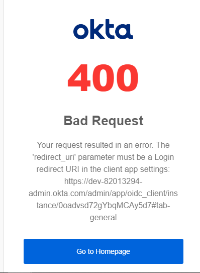
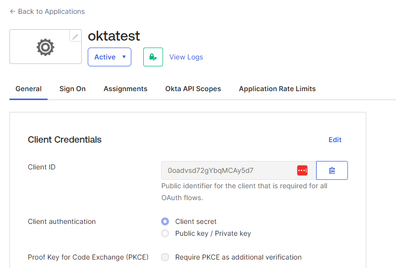
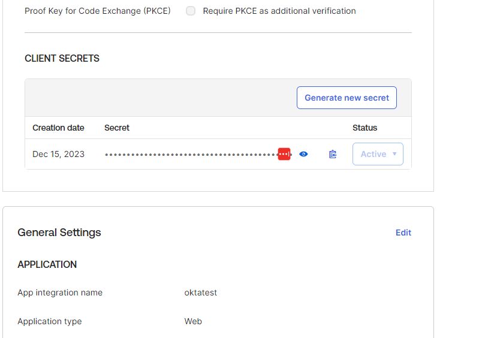
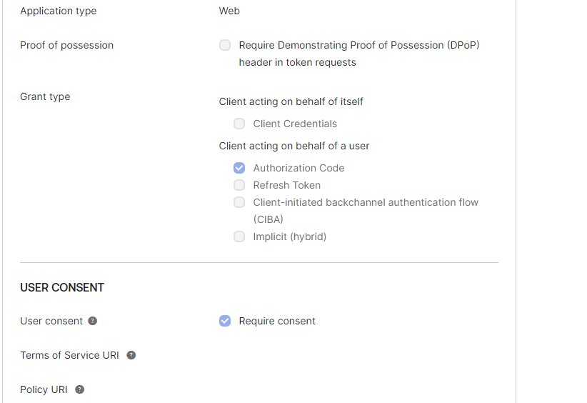
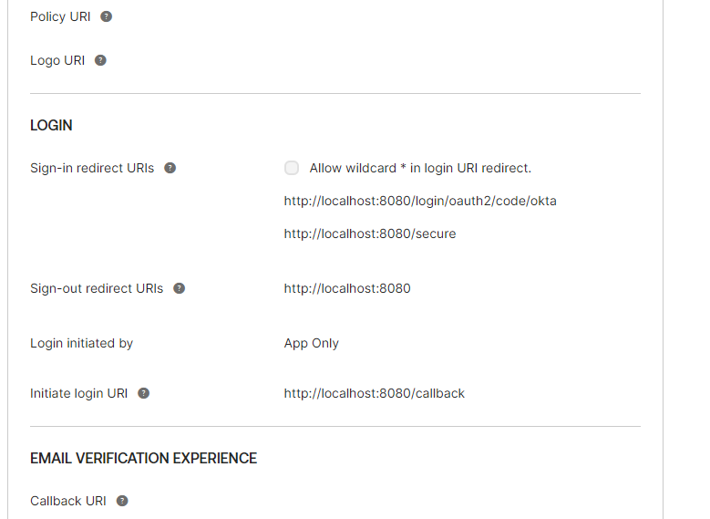
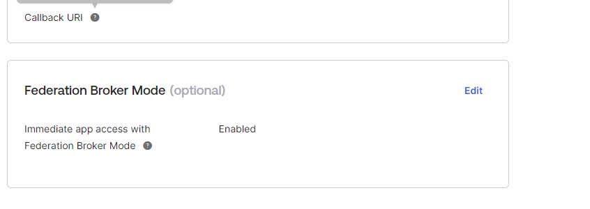

# zkdemo
Secure ZK with PAC4J

This demo is based on https://github.com/zkoss/zkspringboot/tree/master/zkspringboot-demos/zkspringboot-minimal-jar.
Here are the minimal changes i made to integrate the whole with pac4j and Okta:

build.gradle:
i just added some extra dependencies:
- org.pac4j:spring-webmvc-pac4j:8.0.0
- org.pac4j:pac4j-oidc:6.0.0

application.properties:
- zk.homepage=minimal
- zk.zul-view-resolver-prefix=/zul
- extra config for pac4j...

AppControler.java:
- only one mapping to @RequestMapping("/secure/*")

SecurityConfig.java: Its the configuration for Pac4j im struggling with:
- i create an PAC4J OIDC client
- i secure my URL

but at run time i get OKTA error:

It claims about some REDIRECT URI parameter not present in the client settings....

At the Okta admin part, i use my "always free" test account with the following setup:

